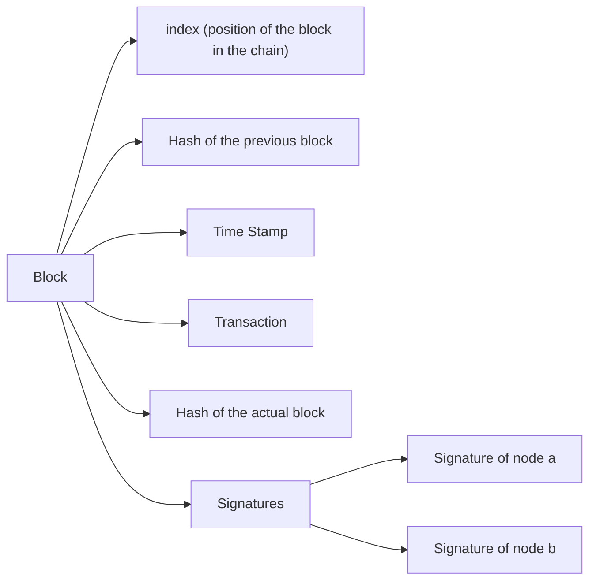

# SwelCoin
The CryptoCurrency for Swelshin

## Schemes

### Block
this is the block structure

**Blocks Validation System**: The involved nodes need to grant that block

```mermaid

flowchart LR
    block["Block"]
    index["index (position of the block in the chain)"]
    prevhash["Hash of the previous block"]
    signaturea["Signature of node a"]
    signatureb["Signature of node b"]
    timestamp["Time Stamp"]
    transaction["Transaction"]
    hash["Hash of the actual block"]
    signatures["Signatures"]
    block --> hash
    block --> index
    block --> prevhash
    block --> signatures
    signatures --> signaturea
    signatures --> signatureb
    block --> timestamp
    block --> transaction

```