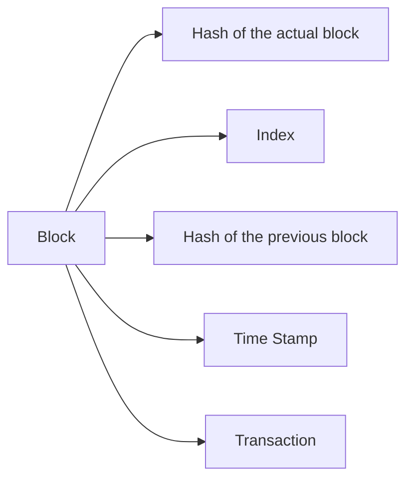
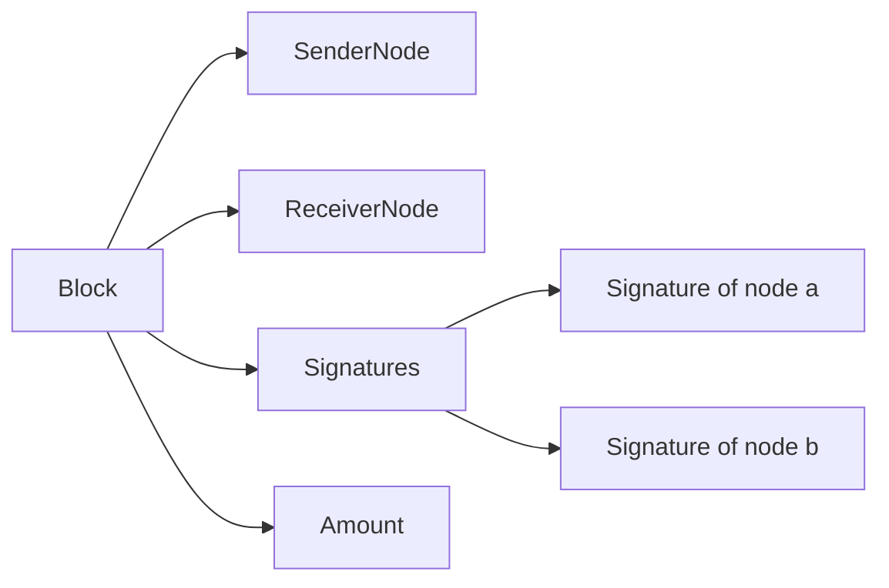

# SwelCoin
The CryptoCurrency for Swelshin

## Schemes

### Block
this is the block structure

### Transaction
This is the transaction structure

**Transaction Validation System**: The involved nodes need to grant that block

