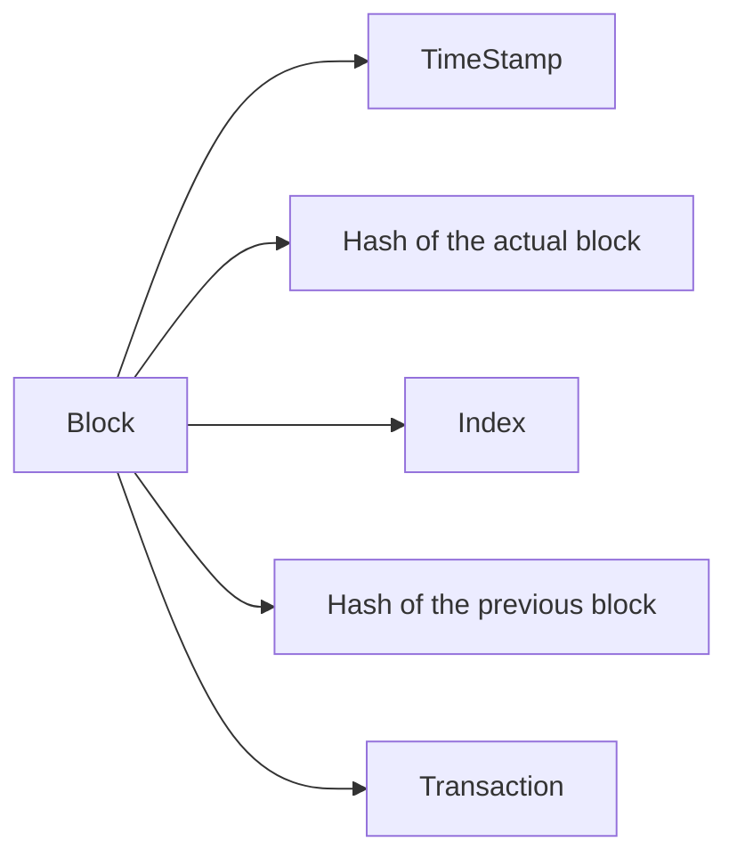
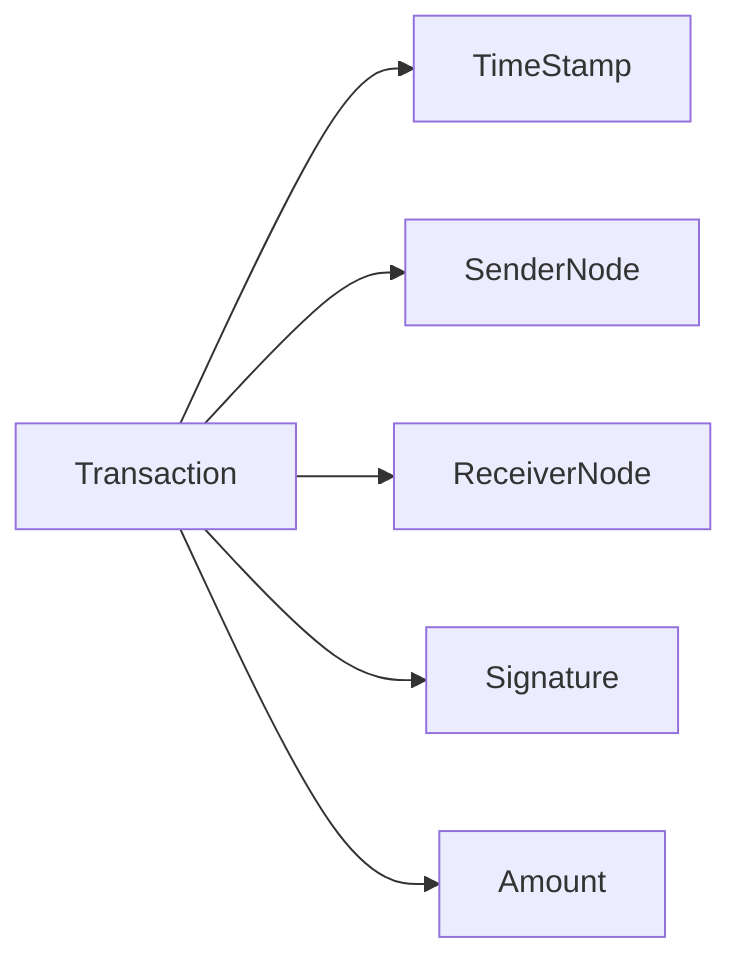

# SwelCoin
The CryptoCurrency for Swelshin

## Schemes

### Block
this is the block structure

### Transaction
This is the transaction structure

**Transaction Validation System**: The Transactions is signed by the emisor, this is a centralized net

